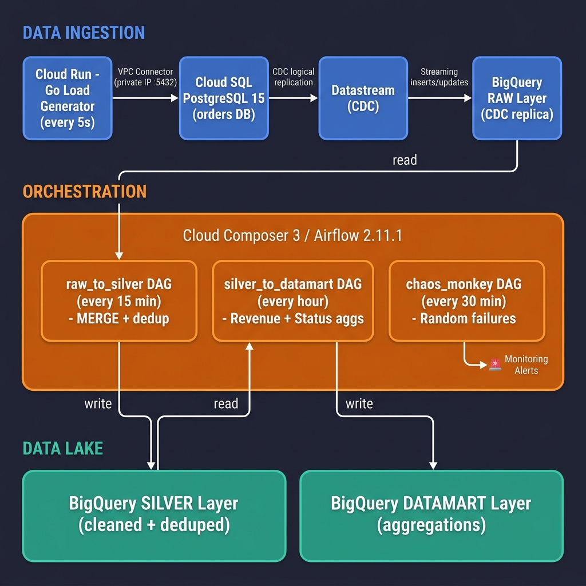

# Data Analytics Monitoring & Alerting — Full Deployment Guide

A comprehensive, step-by-step guide to deploy the complete data pipeline simulation environment and monitoring system from scratch on a **new GCP project**.

> **Runtime**: Cloud Composer 3 · Apache Airflow 2.11.1 · Image `composer-3-airflow-2.11.1-build.5`

---

## Architecture Overview

### End-to-End Data Pipeline



**Data flow**: Cloud Run (Go) → Cloud SQL (PostgreSQL) → Datastream (CDC) → BigQuery RAW → Composer DAGs → BigQuery SILVER / DATAMART

| Stage | Component | Frequency | Details |
|-------|-----------|-----------|---------|
| **Ingestion** | Cloud Run (Go Load Generator) | Every 5s | Inserts ~5 orders + updates ~5 statuses |
| **Source DB** | Cloud SQL PostgreSQL 15 | Continuous | Orders table with CDC logical replication |
| **CDC** | Datastream | Streaming | Replicates inserts/updates to BigQuery |
| **RAW Layer** | BigQuery `monitoring_lab_raw` | Real-time | CDC replica of orders table |
| **Transform** | Composer: `raw_to_silver` DAG | Every 15 min | MERGE + dedup into silver layer |
| **Aggregate** | Composer: `silver_to_datamart` DAG | Every hour | Revenue by product, order status counts |
| **Chaos** | Composer: `chaos_monkey` DAG | Every 30 min | Random failures to trigger alerts |

---

### Monitoring & Alerting Layer

| Monitored Service | Alert Policies | What They Detect |
|-------------------|---------------|------------------|
| **Cloud Composer** (8 alerts) | DAG Run Failures | DAG runs ending in `failed` state |
| | Task Failures | Individual task instances failing |
| | Scheduler Heartbeat | Scheduler stops sending heartbeats |
| | Worker Evictions | Worker pods evicted (resource pressure) |
| | Database Health | Airflow metadata DB unhealthy |
| | Error Logs | ERROR-level structured logs detected |
| | DAG Parse Errors | DAGs failing to parse/import |
| | Webserver Health | Airflow webserver health < 90% |
| **Datastream** (4 alerts) | High Replication Lag | Lag exceeds threshold (default 600s) |
| | Stream Unhealthy | Stream enters error state |
| | Throughput Stale | No events processed for 10+ minutes |
| | Backfill Failures | Backfill operations failing |
| **BigQuery** (3 alerts) | High Slot-Time | Query execution time exceeds threshold |
| | Data Freshness | No new data for extended period |
| | Scheduled Query Failures | BQ scheduled queries failing |

**Dashboards (3)**: Composer Operational · Pipeline Health · Cost & Storage

**Scheduled Reports (2)**: Daily Slot-Time Audit · Daily Storage Billing Comparison

**Notification Channels**: Email (required) · Slack (optional)

---

## Project Structure

```
da-monitoring-alerting/
├── loadgen/                          # Go load generator (Cloud Run)
│   ├── main.go                       #   App: inserts/updates orders every 5s
│   ├── Dockerfile                    #   Multi-stage build
│   ├── go.mod / go.sum               #   Dependencies
│   └── README.md                     #   Load generator docs
│
├── dags/                             # Airflow DAGs (deployed to Composer)
│   ├── raw_to_silver.py              #   RAW → SILVER transformation
│   ├── silver_to_datamart.py         #   SILVER → DATAMART aggregation
│   ├── chaos_monkey.py               #   Random failure generator
│   ├── callbacks.py                  #   Alert callback helpers
│   └── config/notebooks.yaml         #   Notebook orchestration config
│
├── terraform/
│   ├── simulation/                   # Simulation environment (infra)
│   │   ├── main.tf                   #   Provider, APIs
│   │   ├── composer.tf               #   Cloud Composer 3
│   │   ├── cloudsql.tf               #   Cloud SQL PostgreSQL
│   │   ├── cloudrun.tf               #   Cloud Run + VPC Connector [NEW]
│   │   ├── datastream.tf             #   Datastream CDC pipeline
│   │   ├── bigquery.tf               #   BQ datasets (raw/silver/datamart)
│   │   ├── networking.tf             #   VPC, private service access
│   │   ├── gcs.tf                    #   Data lake bucket
│   │   ├── pubsub.tf                 #   Alert forwarding
│   │   ├── variables.tf              #   Input variables
│   │   ├── outputs.tf                #   Outputs (incl. monitoring inputs)
│   │   └── terraform.tfvars          #   Your project settings
│   │
│   └── monitoring/                   # Monitoring & Alerting (REUSABLE)
│       ├── main.tf                   #   Provider, APIs
│       ├── monitoring_composer.tf    #   8 Composer alert policies
│       ├── monitoring_datastream.tf  #   4 Datastream alert policies
│       ├── monitoring_bigquery.tf    #   3 BQ alerts + scheduled queries
│       ├── monitoring_channels.tf    #   Email + Slack notification
│       ├── dashboard_composer.tf     #   Composer operational dashboard
│       ├── dashboard_pipeline_health.tf  # Cross-service dashboard
│       ├── dashboard_cost_storage.tf #   Cost & storage dashboard
│       ├── variables.tf              #   Input variables
│       ├── outputs.tf                #   Output summary
│       ├── terraform.tfvars.example  #   Example config
│       └── terraform.tfvars          #   Generated from simulation outputs
│
├── scripts/
│   ├── setup_pipeline.sh             #   One-command pipeline setup [NEW]
│   └── deploy_dags.sh                #   DAG deployment to Composer
│
├── plugins/                          #   Airflow plugins
├── docs/                             #   Additional documentation
├── DEPLOYMENT_GUIDE.md               #   ← THIS FILE
├── README.md                         #   Project overview
└── COST_ANALYSIS.md                  #   Cost breakdown
```

---

## Prerequisites

- [ ] A GCP project with billing enabled
- [ ] `gcloud` CLI authenticated (`gcloud auth login`)
- [ ] `terraform` >= 1.5.0 installed
- [ ] `go` >= 1.22 installed (for local testing only; Cloud Build handles the actual build)
- [ ] Owner or Editor role on the project

---

## Phase 1: Provision Simulation Environment

> **Time estimate**: ~30 minutes (Composer takes ~20-25 min)

### Step 1.1: Configure Variables

```bash
cd terraform/simulation

# Copy and edit the variables file
cp terraform.tfvars.example terraform.tfvars
```

Edit `terraform.tfvars`:
```hcl
project_id          = "YOUR-PROJECT-ID"
region              = "us-central1"
alert_email         = "your-email@example.com"
cloudsql_db_password = "choose-a-strong-password"
```

### Step 1.2: Initialize and Apply

```bash
terraform init
terraform plan -out=tfplan
terraform apply "tfplan"
```

**What gets created:**

| Resource | Name | Purpose |
|----------|------|---------|
| Cloud Composer 3 | `monitoring-lab-composer` | Airflow 2.11.1 orchestration |
| Cloud SQL PostgreSQL 15 | `monitoring-lab-source-pg` | CDC source database |
| VPC Network | `monitoring-lab-vpc` | Private connectivity |
| VPC Access Connector | `monitoring-lab-vpc-connector` | Cloud Run → Cloud SQL |
| Datastream Stream | `monitoring-lab-stream` | CDC replication to BQ |
| BigQuery Datasets | `raw`, `silver`, `datamart` | Data lake layers |
| GCS Bucket | `{project}-monitoring-lab-datalake` | Data lake storage |
| Pub/Sub Topic | `composer-alerts` | Alert forwarding |
| Artifact Registry | `monitoring-lab-repo` | Container images |

### Step 1.3: Note the Outputs

After apply completes, Terraform prints outputs including a pre-formatted block for the monitoring module:

```bash
terraform output monitoring_module_inputs
```

Save this — you'll paste it into `terraform/monitoring/terraform.tfvars` in Phase 3.

---

## Phase 2: Deploy the Data Pipeline

> **Time estimate**: ~5 minutes

Run the single setup script:

```bash
# From the project root
bash scripts/setup_pipeline.sh
```

This script performs the following steps in order:

### Step 2.1: Build & Deploy Go Load Generator

```bash
# Builds the Go app in Cloud Build and pushes to Artifact Registry
gcloud builds submit loadgen/ \
  --tag ${REGION}-docker.pkg.dev/${PROJECT_ID}/monitoring-lab-repo/loadgen:latest

# Updates the Cloud Run service with the new image
gcloud run services update monitoring-lab-loadgen \
  --image ${REGION}-docker.pkg.dev/${PROJECT_ID}/monitoring-lab-repo/loadgen:latest \
  --region ${REGION}
```

### Step 2.2: Wait for First Data

The script waits ~30 seconds for the load generator to insert initial data into Cloud SQL.

### Step 2.3: Configure PostgreSQL Replication

```bash
# Connects to Cloud SQL and creates:
# 1. PUBLICATION for the orders table
# 2. LOGICAL REPLICATION SLOT for Datastream
gcloud sql connect monitoring-lab-source-pg \
  --user=datastream_user --database=source_db
```

```sql
CREATE PUBLICATION datastream_pub FOR TABLE orders;
SELECT pg_create_logical_replication_slot('datastream_slot', 'pgoutput');
```

### Step 2.4: Start Datastream

```bash
gcloud datastream streams update monitoring-lab-stream \
  --location=us-central1 \
  --state=RUNNING
```

### Step 2.5: Deploy DAGs to Composer

```bash
bash scripts/deploy_dags.sh
```

This uploads all DAGs from `dags/` to the Composer environment's GCS bucket.

### Verification Checklist

After the script completes:

- [ ] **Cloud Run**: Check logs → "Inserted 5 orders, updated 5 statuses"
- [ ] **Cloud SQL**: `SELECT count(*) FROM orders;` → growing row count
- [ ] **Datastream Console**: Stream state = RUNNING, events flowing
- [ ] **BigQuery**: `SELECT * FROM monitoring_lab_raw.orders LIMIT 10;` → rows appearing
- [ ] **Composer UI**: DAGs visible and parsing successfully

---

## Phase 3: Deploy Monitoring & Alerting

> **Time estimate**: ~2 minutes
>
> **Key design**: The monitoring module is **completely independent** from the simulation. You can point it at any existing GCP project with Composer, Datastream, and BigQuery.

### Step 3.1: Configure Variables

```bash
cd terraform/monitoring

# Paste the output from Phase 1, Step 1.3
vim terraform.tfvars
```

Or copy the example and fill in:
```bash
cp terraform.tfvars.example terraform.tfvars
```

Required variables:
```hcl
project_id            = "YOUR-PROJECT-ID"
region                = "us-central1"
alert_email           = "your-email@example.com"
composer_env_name     = "monitoring-lab-composer"
datastream_stream_ids = ["monitoring-lab-stream"]
bq_monitored_datasets = ["monitoring_lab_raw", "monitoring_lab_silver"]
gcs_monitored_buckets = ["YOUR-PROJECT-ID-monitoring-lab-datalake"]
```

### Step 3.2: Initialize and Apply

```bash
terraform init
terraform plan -out=tfplan
terraform apply "tfplan"
```

**What gets created:**

| Category | Count | Details |
|----------|-------|---------|
| **Composer Alerts** | 8 | DAG failures, task failures, scheduler heartbeat, worker evictions, DB health, error logs, parse errors, webserver health |
| **Datastream Alerts** | 4 | High lag, unhealthy stream, throughput stale, backfill failures |
| **BigQuery Alerts** | 3 | High slot-time, data freshness, scheduled query failures |
| **Dashboards** | 3 | Composer operational, pipeline health, cost & storage |
| **Scheduled Queries** | 2 | Daily slot-time audit, daily storage comparison |
| **Log-based Metrics** | 4 | Task errors, DAG parse errors, datastream errors, BQ query failures |
| **Notification Channels** | 1-2 | Email (required) + Slack (optional) |

---

## Phase 4: Verify Monitoring

> **Time estimate**: ~30 minutes (wait for chaos_monkey to trigger)

### 4.1: Check Dashboards

Navigate to **Cloud Monitoring → Dashboards**:

1. **Composer Operational Health** — scheduler heartbeat, worker pod count, DAG run history
2. **Pipeline Health** — cross-service view: Datastream events, BQ query times, task outcomes
3. **Cost & Storage** — BQ slot usage, GCS bucket sizes, dataset growth

### 4.2: Verify Alert Policies

Navigate to **Cloud Monitoring → Alerting → Policies**:
- All 15 policies should be listed as "Enabled"
- The `chaos_monkey` DAG will trigger failures within ~30 minutes

### 4.3: Check Email Notifications

The `chaos_monkey` DAG runs every 30 minutes with:
- **30% chance** of raising a Python exception → "Failed Task Instances" alert
- **20% chance** of running invalid SQL → "Failed DAG Runs" alert

When triggered, you'll receive an email at `alert_email` with:
- Alert policy name
- Condition that was violated
- Resource labels (DAG ID, task ID)
- Link to Cloud Monitoring incident

---

## Tear Down

### Remove Monitoring (keeps infrastructure)

```bash
cd terraform/monitoring
terraform destroy
```

### Remove Everything

```bash
# Monitoring first
cd terraform/monitoring
terraform destroy

# Then simulation infrastructure
cd ../simulation
terraform destroy
```

> **⏱️ Composer deletion takes ~10-15 minutes.**

---

## Cost Estimate

See [COST_ANALYSIS.md](COST_ANALYSIS.md) for detailed breakdown.

**Rough monthly cost for this lab**:

| Service | Estimated Cost |
|---------|----------------|
| Cloud Composer 3 (Small) | ~$350/month |
| Cloud SQL (db-f1-micro) | ~$10/month |
| Cloud Run (1 instance, always-on) | ~$5/month |
| Datastream | ~$5/month (low volume) |
| BigQuery | ~$5/month (on-demand) |
| Cloud Monitoring | Free tier |
| **Total** | **~$375/month** |

> [!TIP]
> For cost savings, destroy the environment after testing. Composer dominates the cost.

---

## Files to Create/Modify

This is the complete list of files that need to be created or modified from the current state:

### New Files

| File | Description |
|------|-------------|
| `loadgen/main.go` | Go load generator application |
| `loadgen/Dockerfile` | Multi-stage Docker build |
| `loadgen/go.mod` | Go module definition |
| `terraform/simulation/cloudrun.tf` | Cloud Run service + VPC connector + Artifact Registry |
| `dags/raw_to_silver.py` | RAW → SILVER transformation DAG |
| `dags/silver_to_datamart.py` | SILVER → DATAMART aggregation DAG |
| `dags/chaos_monkey.py` | Random failure generator DAG |
| `scripts/setup_pipeline.sh` | One-command pipeline setup |

### Modified Files

| File | Changes |
|------|---------|
| `terraform/simulation/main.tf` | Add `run.googleapis.com`, `vpcaccess.googleapis.com`, `artifactregistry.googleapis.com` APIs |
| `terraform/simulation/cloudsql.tf` | Add separate `loadgen_user` for the Go app |
| `terraform/simulation/datastream.tf` | Update to match enriched orders schema |
| `terraform/simulation/variables.tf` | Add `loadgen_user_password` variable |
| `terraform/simulation/outputs.tf` | Add Cloud Run URL, VPC connector outputs |
| `terraform/simulation/composer.tf` | Add `BQ_DATASET_DATAMART` env variable |
