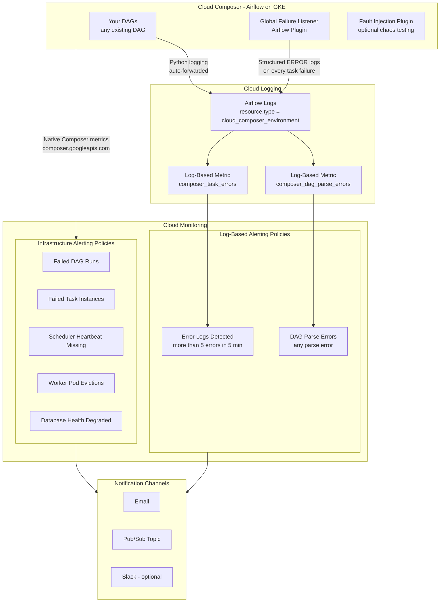
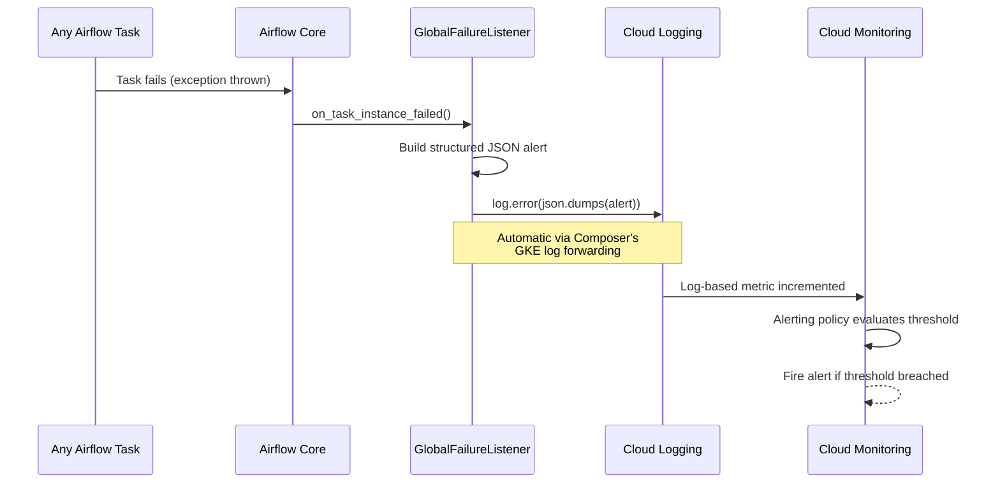
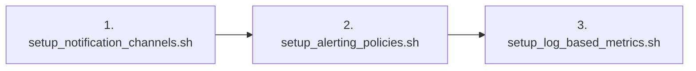
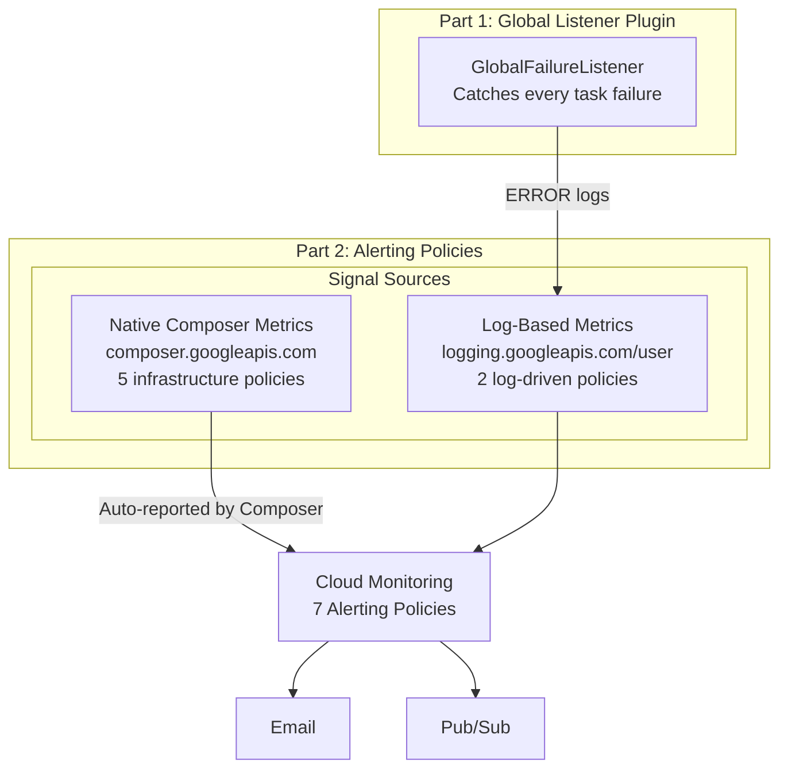

# How Cloud Composer Gets Monitored

This document explains the two core mechanisms that provide observability and alerting for Cloud Composer DAGs — **without requiring any changes to your existing DAGs**.

---

## Architecture Overview



> **Key insight**: Cloud Composer automatically forwards all Airflow logs (Python `logging` output) to Cloud Logging. There is no Cloud Logging SDK call in the code — the integration is built into Composer's GKE infrastructure.

---

## Part 1: Global Failure Listener Plugin

**File**: [`plugins/global_failure_listener.py`](../plugins/global_failure_listener.py)

### What It Does

The Global Failure Listener is an **Airflow Plugin** that uses the [Listener API](https://airflow.apache.org/docs/apache-airflow/stable/administration-and-deployment/listeners.html) (available since Airflow 2.6) to automatically intercept **every task failure across all DAGs** — without requiring any per-DAG configuration.

### How It Works



### The Structured Log Payload

When a task fails, the listener emits an ERROR-level log with this JSON structure:

```json
{
  "alert_type": "TASK_FAILURE",
  "source": "global_listener",
  "message": "Task my_task in DAG my_dag failed",
  "dag_id": "my_dag",
  "task_id": "my_task",
  "run_id": "scheduled__2026-07-27T06:00:00+00:00",
  "try_number": 1,
  "max_tries": 1,
  "execution_date": "2026-07-27T06:00:00+00:00",
  "log_url": "https://...",
  "exception": "Error details here",
  "previous_state": "running",
  "operator": "PythonOperator",
  "duration": "12.5",
  "timestamp": "2026-07-27T06:01:23.456789+00:00"
}
```

### Key Design Decisions

| Decision | Rationale |
|----------|-----------|
| **Plugin, not per-DAG callback** | Covers ALL DAGs automatically, including ones you haven't modified |
| **`log.error()` not direct API call** | Leverages Composer's built-in log forwarding; no Cloud Logging SDK dependency |
| **Try/except wrapper** | Never lets the listener itself break the task lifecycle |
| **Both `logical_date` and `execution_date`** | Compatibility across Airflow 2.x versions (`execution_date` deprecated in 2.11.1) |

### Relationship to Per-DAG Callbacks

The project also includes per-DAG callbacks in [`dags/callbacks.py`](../dags/callbacks.py) (used by [`dags/sample_elt_pipeline.py`](../dags/sample_elt_pipeline.py)):

| Scenario | What Fires |
|----------|-----------|
| DAG **has** `on_failure_callback` | **Both** the callback AND the global listener fire. Cloud Monitoring deduplicates via `autoClose` windows. |
| DAG **does NOT have** `on_failure_callback` | **Only** the global listener fires — the failure is still captured. |

> **For existing DAGs**: The global listener is the zero-effort path. Deploy it once and every DAG is covered. Add per-DAG callbacks later only for DAGs that need custom alert payloads.

### Deployment

```bash
# Upload to Composer's plugins folder — no DAG changes, no restarts needed
gcloud composer environments storage plugins import \
  --environment=$COMPOSER_ENV_NAME \
  --location=$COMPOSER_LOCATION \
  --source=plugins/global_failure_listener.py
```

---

## Part 2: Alerting Policies & Log-Based Metrics

The alerting layer has **three scripts** that must be run in order:



### Step 1 — Notification Channels

**File**: [`monitoring/setup_notification_channels.sh`](../monitoring/setup_notification_channels.sh)

Creates the destinations where alerts are delivered:

| Channel | Type | Purpose |
|---------|------|---------|
| **Composer Alerts - Email** | `email` | Human-readable notifications to on-call |
| **Composer Alerts - Pub/Sub** | `pubsub` | Programmatic consumption (topic: `composer-alerts`) |

Also creates a debug subscription (`composer-alerts-debug-sub`) for manual pull during troubleshooting.

```bash
export GCP_PROJECT_ID="your-project-id"
export ALERT_EMAIL="oncall@yourcompany.com"
bash monitoring/setup_notification_channels.sh
```

---

### Step 2 — Infrastructure Alerting Policies

**File**: [`monitoring/setup_alerting_policies.sh`](../monitoring/setup_alerting_policies.sh)

Creates **5 alerting policies** that monitor **native Composer metrics** (the `composer.googleapis.com/*` metric family). These are infrastructure-level signals that Composer reports automatically:

| # | Policy | Metric | Condition | Severity |
|---|--------|--------|-----------|----------|
| 1 | **Failed DAG Runs** | `composer.googleapis.com/environment/dagrun/count` | `state=failed > 0` in 5 min | Critical |
| 2 | **Failed Task Instances** | `composer.googleapis.com/environment/task/instance_count` | `state=failed > 0` in 5 min | Critical |
| 3 | **Scheduler Heartbeat Missing** | `composer.googleapis.com/environment/scheduler_heartbeat_count` | Absent for 5 min | Critical |
| 4 | **Worker Pod Evictions** | `composer.googleapis.com/environment/worker/pod_eviction_count` | `> 0` in 15 min | Warning |
| 5 | **Database Health Degraded** | `composer.googleapis.com/environment/database_health` | `state != SERVING` for 5 min | Critical |

> These policies use **native Composer metrics**, not logs. They are emitted by Cloud Composer's managed infrastructure automatically — no code or plugin changes needed.

```bash
export GCP_PROJECT_ID="your-project-id"
export COMPOSER_ENV_NAME="your-composer-env"
export COMPOSER_LOCATION="us-central1"
bash monitoring/setup_alerting_policies.sh
```

---

### Step 3 — Log-Based Metrics & Alerts

**File**: [`monitoring/setup_log_based_metrics.sh`](../monitoring/setup_log_based_metrics.sh)

Creates **2 log-based metrics** and **2 alerting policies** that turn Cloud Logging entries into countable, alertable signals:

#### Log-Based Metrics

| Metric | Log Filter | What It Catches |
|--------|-----------|-----------------|
| `composer_task_errors` | `resource.type="cloud_composer_environment"` + `severity>=ERROR` | All ERROR+ logs from tasks — including the structured JSON from the global listener, per-DAG callbacks, and any `logger.error()` in your task code |
| `composer_dag_parse_errors` | Same + `textPayload=~"DagFileProcessorProcess\|DagBag\|import_errors"` | DAG import/parse failures (syntax errors, missing dependencies) |

#### Alerting Policies on Log-Based Metrics

| Policy | Condition | Auto-Close |
|--------|-----------|------------|
| **Composer - Error Logs Detected** | `composer_task_errors > 5` in 5 minutes | 30 min |
| **Composer - DAG Parse Errors** | `composer_dag_parse_errors > 0` | 30 min |

```bash
export GCP_PROJECT_ID="your-project-id"
export COMPOSER_ENV_NAME="your-composer-env"
bash monitoring/setup_log_based_metrics.sh
```

---

## How the Two Parts Work Together



| What Gets Monitored | How | Covered By |
|---------------------|-----|------------|
| **Task failures** (any DAG) | Global listener emits ERROR log → log-based metric → alert | Part 1 + Part 2 |
| **DAG run failures** | Native Composer metric `dagrun/count{state=failed}` | Part 2 only |
| **DAG parse errors** | Log-based metric catches parser error patterns | Part 2 only |
| **Scheduler health** | Native metric `scheduler_heartbeat_count` absence | Part 2 only |
| **Worker resource pressure** | Native metric `worker/pod_eviction_count` | Part 2 only |
| **Metadata DB health** | Native metric `database_health` | Part 2 only |

> **Part 1 feeds Part 2.** The global listener generates the ERROR logs that the `composer_task_errors` log-based metric counts. Without Part 1, DAGs without `on_failure_callback` would only be caught by the native `dagrun/count` metric (which is coarser — it reports at the DAG-run level, not per-task).

---

## Quick Start for Existing DAGs

```bash
# 1. Deploy the global listener plugin (zero DAG changes)
gcloud composer environments storage plugins import \
  --environment=$COMPOSER_ENV_NAME \
  --location=$COMPOSER_LOCATION \
  --source=plugins/global_failure_listener.py

# 2. Set up notification channels
export GCP_PROJECT_ID="your-project-id"
export ALERT_EMAIL="oncall@yourcompany.com"
bash monitoring/setup_notification_channels.sh

# 3. Create infrastructure alerting policies
export COMPOSER_ENV_NAME="your-composer-env"
export COMPOSER_LOCATION="us-central1"
bash monitoring/setup_alerting_policies.sh

# 4. Create log-based metrics and alerts
bash monitoring/setup_log_based_metrics.sh
```

After these 4 commands, every task failure, DAG failure, parse error, scheduler issue, pod eviction, and database health degradation across **all your DAGs** is monitored and alerted on — with zero code changes to your existing pipelines.
